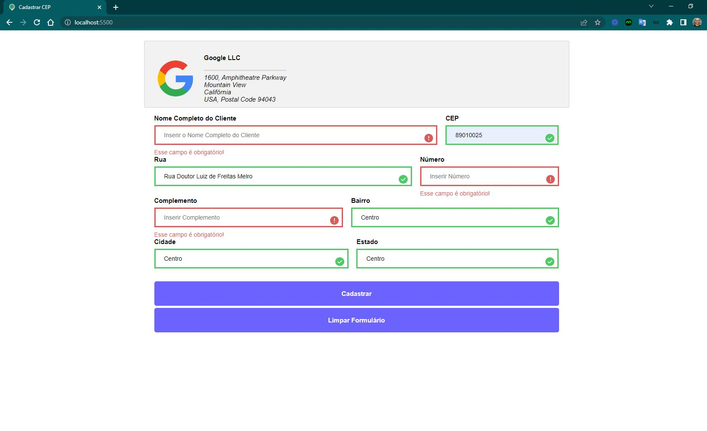
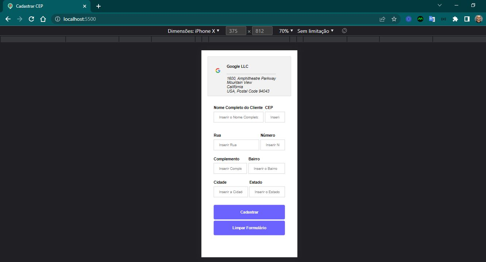
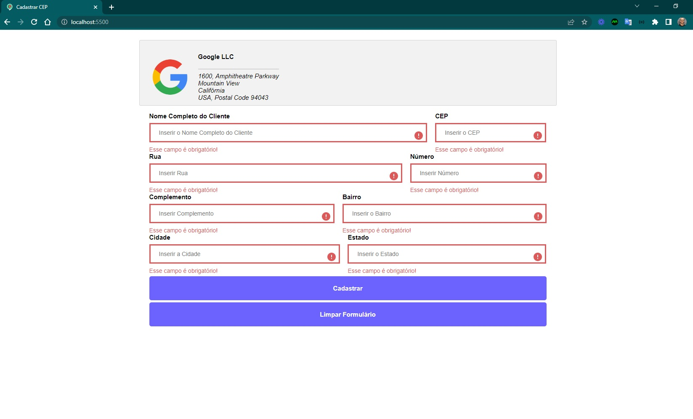
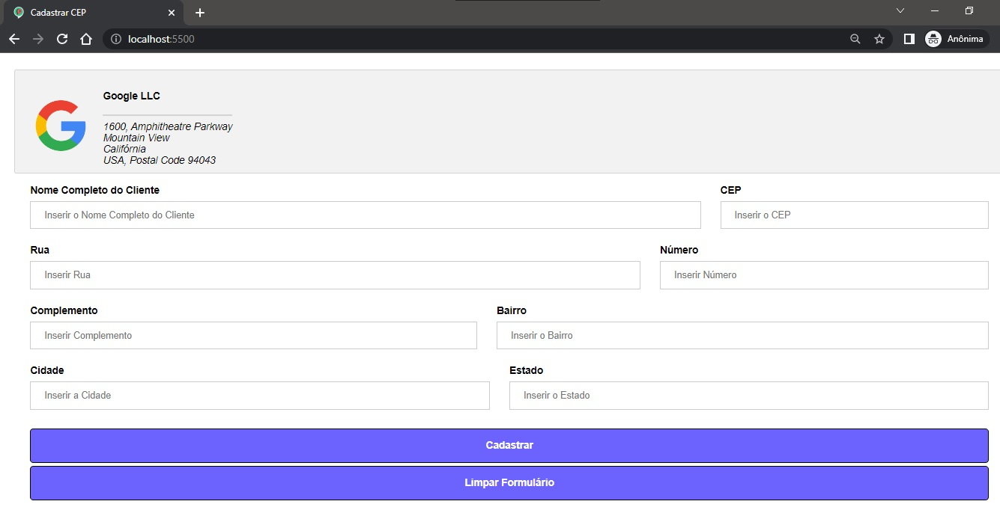
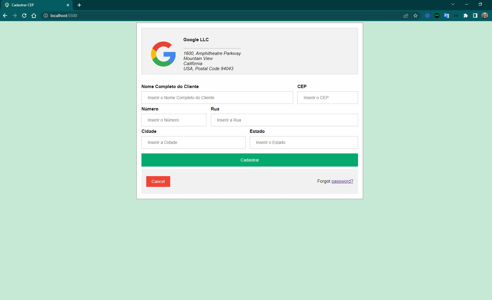

<h4 align="center"> 
	🚧 Cadastrar CEP 🚀
</h4>

  

 

## 💻 Sobre o projeto

Aplicação em JavaScript, CSS e HTML que simula a etapa de cadastro de endereço e escolha do mesmo para entrega de um produto, com autopreenchimento a partir do CEP informado.

> 🎯 **Origem:** desafio técnico aplicado em processo seletivo para vaga de desenvolvedor.

## ✅ Requisitos

- [x] Logo com endereço da empresa
- [x] Formulário com campos de nome do cliente e endereço
- [x] Preenchimento automático dos campos após informar o CEP
- [x] Validações necessárias no formulário

## ⭐ Extras

- [x] Favicon
- [x] Navegação entre campos com Enter (`enterkeyhint="next"`)
- [x] Atributo `autocomplete`
- [x] Limpar formulário para nova busca de CEP
- [x] Botão para limpar o formulário
- [x] Validação das informações vindas da API de CEP
- [x] Responsividade

## 🎯 Pontos de destaque

- Arquitetura
- Interface e usabilidade
- Clean code
- Responsividade

## 🛠️ Ambiente de desenvolvimento

- Node v10.16.0
- VS Code
- Sublime Text 3
- Git Bash

## 🖥️ Evolução das soluções — v1.0-layout

**Etapa 3:**

  
  
  

 

**Etapa 2:**

  

 

**Etapa 1:**

  

 

## 📋 Próximo passo

- [ ] Salvar os endereços em Local Storage
- [ ] Segunda página/aba para escolher entre endereços previamente cadastrados como endereço de entrega, preenchendo os campos automaticamente
- [ ] Permitir a exclusão de um endereço já cadastrado

## 🔧 Aperfeiçoamento

- [ ] Acessibilidade

## 📚 Referências

- [Template de formulário — W3Schools](https://www.w3schools.com/howto/howto_css_login_form.asp)
- [Formulários — web.dev/learn/forms](https://web.dev/learn/forms/)
- [Brasil API — CEP](https://brasilapi.com.br/docs#tag/CEP)
- [ViaCEP](https://viacep.com.br/)
- [Consulta de CEP — Guia Mais](https://cep.guiamais.com.br/)
- [Busca CEP — Correios](https://buscacepinter.correios.com.br/app/endereco/index.php)
- [Autopreencher com API de CEP — parte 1](https://www.youtube.com/watch?v=nJtwKUQkAGo&t=1033s)
- [Autopreencher com API de CEP — parte 2](https://www.youtube.com/watch?v=imk6Y0viabg)
- [Validação de formulário](https://www.youtube.com/watch?v=SazrvkE7t-g)
- [Operador ternário — MDN](https://developer.mozilla.org/pt-BR/docs/Web/JavaScript/Reference/Operators/Conditional_Operator)

**Notas de teste (CEPs usados durante o desenvolvimento):**
- CEP com campo indefinido: `68160-000`
- CEP com resposta completa: `02227-001`

---

Feito com ❤️ por Douglas A. B. Novato 👋🏽 [Entre em contato!](https://www.linkedin.com/in/douglasabnovato/)