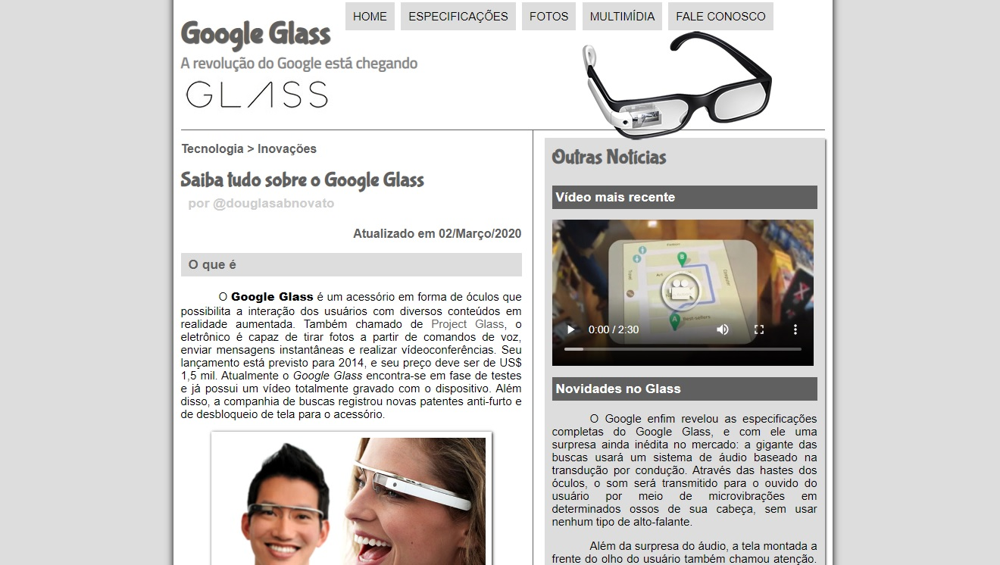
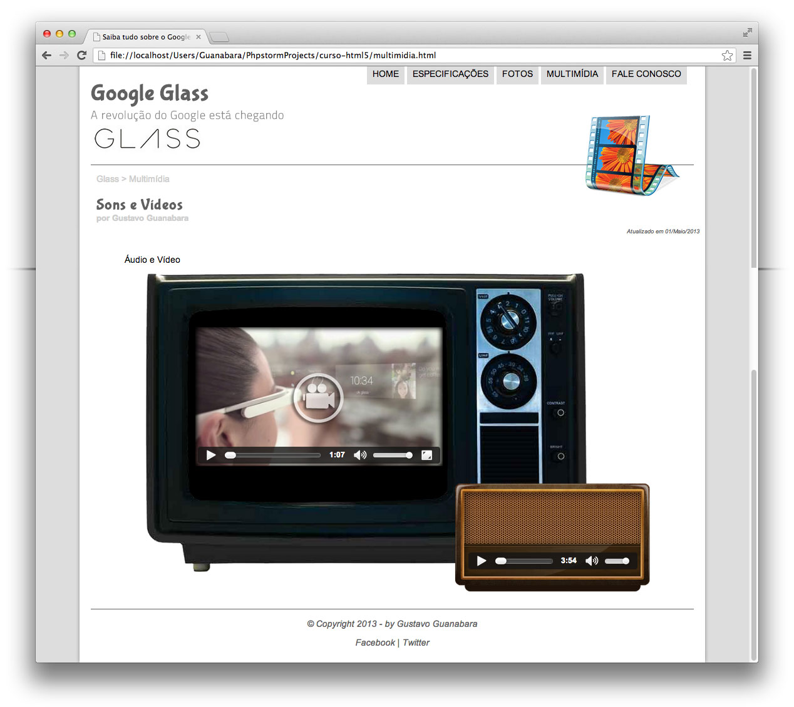

<h4 align="center"> 
	🚧 Google Glass 🚀
</h4> 

<h1 align="center">
    
</h1> 

## 💻🔖 Sobre o projeto

Recriação de um site institucional completo sobre o Google Glass, com cinco páginas interligadas (Início, Especificações, Fotos, Multimídia e Fale Conosco), seguindo um layout de referência fiel ao produto real.

🔗 [Hospedado em Vercel](https://google-glass.vercel.app/)

## ✨ Funcionalidades por página

- **🏠 Início** — apresentação do produto, com menu que troca de imagem ao passar o mouse (`onmouseover`/`onmouseout`)
- **📐 Especificações** — mapa de imagem clicável, com conteúdo específico exibido via `iframe`
- **📸 Fotos** — galeria com efeito de hover e descrição de cada imagem
- **🎬 Multimídia** — player de áudio e vídeo, com múltiplos formatos por arquivo (`.mp4`/`.webm`/`.ogg` para vídeo, `.mp3`/`.m4a`/`.ogg` para áudio), garantindo compatibilidade entre navegadores diferentes
- **✉️ Fale Conosco** — formulário de contato e pedido, com cálculo de total e envio via `mailto:`

## 🗂️ Organização do projeto

Branches usadas para guardar as versões do projeto:

| Branch | Papel |
|---|---|
| `main` | Em produção |
| `developer` | Em desenvolvimento das tarefas |
| `v-dev-google-glass` | Primeira versão do projeto |
| `v-dev-mirror-fashion` | Segunda versão do projeto |

## 🎨 Layout de referência

  
  
  
  

## 🛠️ Ferramentas / Tecnologias

- HTML5 / CSS3 / JavaScript
- Git / GitHub
- VS Code
- Fonte customizada: Bubblegum Sans

## 📚 Fonte

Exercício do curso [Curso em Vídeo — Gustavo Guanabara](https://www.youtube.com/watch?v=epDCjksKMok&list=PLHz_AreHm4dlAnJ_jJtV29RFxnPHDuk9o&index=1).

---

Feito com ❤️ por 👋🏽