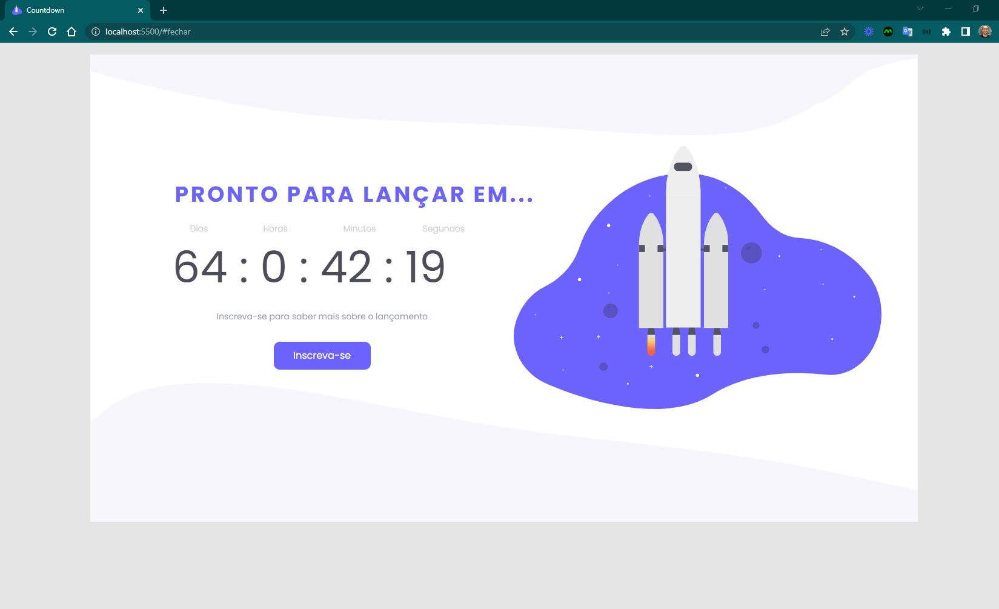
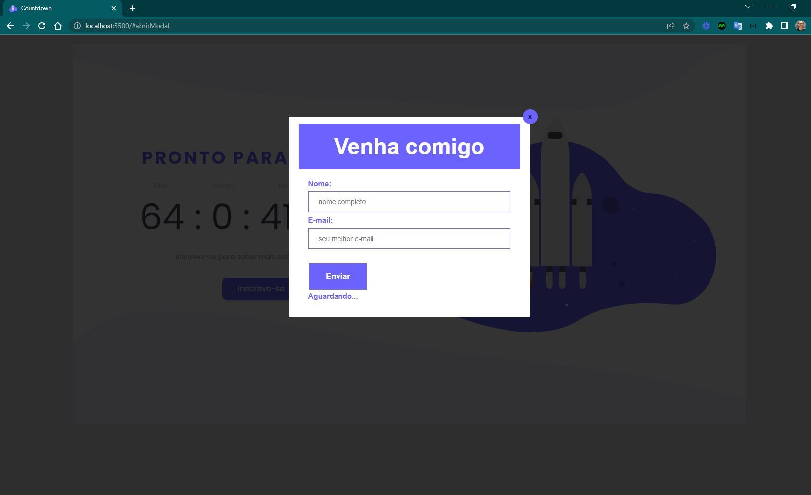
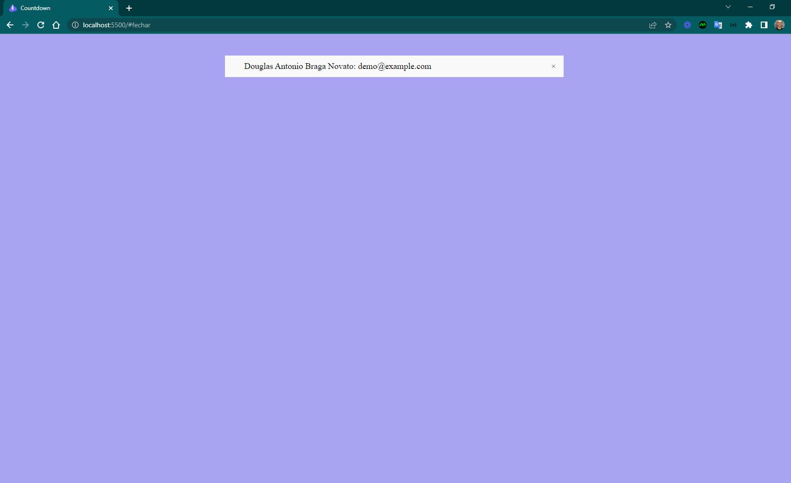
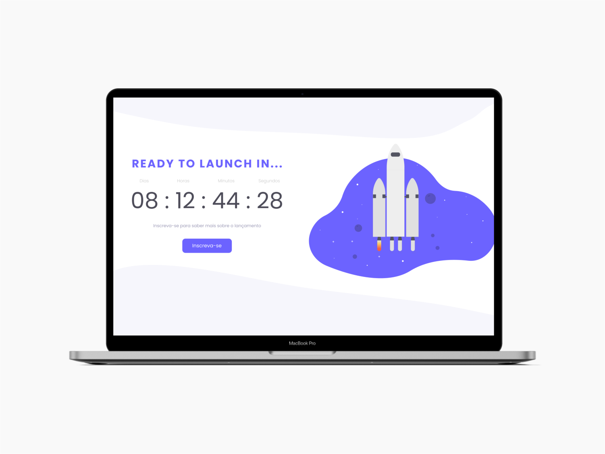

<h4 align="center"> 
	🚧 Countdown 🚀
</h4>

<p align="center">
  
</p>  

## 💻 Sobre o desafio

Página de **coming soon** para o lançamento de um site, produto ou serviço, com um **countdown timer** informando o tempo restante até o lançamento, e um botão de inscrição que abre um modal com formulário de captação.

**Nível:** Intermediário
**Tecnologias:** HTML, CSS e JavaScript
**Layout base:** [Figma oficial do desafio](https://www.figma.com/file/kz1YnxJpqKduyuMgnlBx1d/DD-%2F-Countdown-(Copy)?node-id=0%3A1)

## 💡 Conteúdos aplicados

- [Guia Estelar de JavaScript](https://app.rocketseat.com.br/node/o-guia-estelar-de-java-script) — tipos de dados, variáveis, funções, manipulação de dados

## ✅ Requisitos do desafio

**Principais:**
- [x] Countdown timer com contagem regressiva até o lançamento
- [x] Botão "Inscreva-se"

**Extras:**
- [x] Modal exibido ao clicar em "Inscreva-se"
- [x] Formulário no modal, com campos de nome e e-mail

## 🎨 Style Guide

**Cores:**
```css
:root {
  --black: #4D4C59;
  --purple: #6C63FF;
  --light-grey: #C8C8C8;
  --text-color: #9C9AB6;
}
```

**Tipografia:** [Poppins](https://fonts.google.com/) (weights 400 e 500)

## 🖥️ Telas — evolução do layout (Desktop)

<p align="center">
  
  
  
</p>

<p align="center">
  
</p>

## 📋 Status do projeto

- [x] Organização do README
- [x] Branches `main` e `developer`
- [x] Favicon
- [x] Design construído
- [x] Informações de inscrição
- [x] Modal estilizado com a identidade da home
- [x] Lista de inscritos estilizada
- [ ] [Learn Responsive Design](https://web.dev/learn/design/)
- [ ] [Learn CSS](https://web.dev/learn/css/)
- [ ] **Persistir lista** — inscrições ainda não são salvas de forma permanente

## 📚 Fonte

Desafio da [Rocketseat](https://www.rocketseat.com.br/) — [requisitos completos](https://efficient-sloth-d85.notion.site/Desafio-Countdown-4572ce6f5c91469abe0171f454a13e3f)

---

Feito com ❤️ por Douglas A. B. Novato 👋🏽 [Entre em contato!](https://www.linkedin.com/in/douglasabnovato/)

Participe da [comunidade aberta da Rocketseat](https://discord.gg/bacwY2gDCF)!