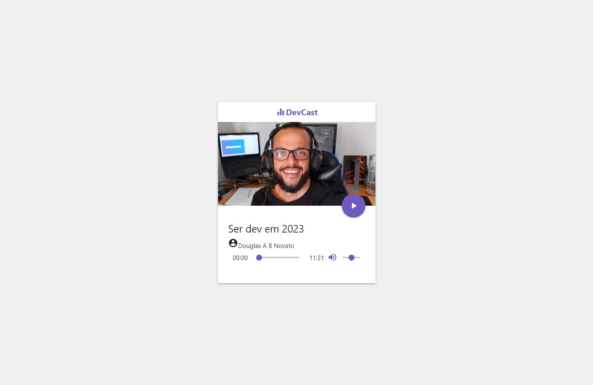
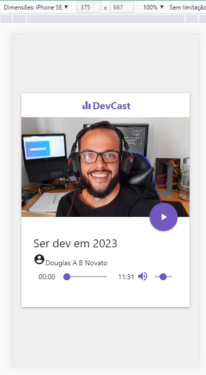

<h4 align="center"> 
	🚧 Dev Cast 🚀
</h4> 

<h1 align="center">
    
</h1>

## 💻 Sobre o projeto

Áudio player personalizado, com controles completos e imagem de capa dinâmica por faixa.

## 🛠 Tecnologias

- [HTML](https://developer.mozilla.org/en-US/docs/Web/HTML) — estrutura
- [CSS](https://developer.mozilla.org/en-US/docs/Web/CSS) — posicionamento e estilização
- [JavaScript](https://developer.mozilla.org/en-US/docs/Web/JavaScript)
- [Materialize CSS](https://materializecss.com)
- [Material Icons](https://material.io/resources/icons/?icon=account_circle&style=baseline)
- [Git](https://git-scm.com/doc) / [GitHub](https://docs.github.com/en)
- [Vercel](https://vercel.com/) (deploy)
- [Can I Use](https://caniuse.com) (compatibilidade)

## 🎨 Desenvolvimento por nível de dificuldade

**Easy:**
- [x] Estrutura inicial do layout (HTML e CSS)
- [x] Criação do player de áudio
- [x] Autoplay ao abrir a janela — **removido** após avaliação (experiência ruim para o usuário)
- [x] Player alimentado com os dados de áudio

**Moderate:**
- [x] Refatoração: objeto único guardando estado, funcionalidades e configurações do player
- [x] Avanço automático para a próxima faixa ao final do áudio
- [x] Loop: ao chegar na última faixa, volta a reproduzir a primeira

**Hard:**
- [x] Customização visual do player
- [x] Funcionalidade dos botões (Play/Pause, Volume, Mute, Seekbar)

## 🖥️ Telas

**Web — v1.0:**
<p align="center">
  
</p>  

**Mobile — v1.0:**
<p align="center">
  
</p>  

## 📋 Próximo passo

- [ ] Adicionar os áudios definitivos
- [ ] Responsividade
- [ ] Acessibilidade
- [ ] Modo dark / light
- [ ] Variação de cores
- [ ] Refino da função de player

## 🚀 Como executar o projeto

Pré-requisitos: [Git](https://git-scm.com) e [Node.js](https://nodejs.org/) instalados, e um editor como [VS Code](https://code.visualstudio.com/).

```bash
# Clone este repositório
$ git clone https://github.com/douglasabnovato/audio-player

# Acesse a pasta do projeto
$ cd audio-player  

# Abra com o Live Server
# A aplicação estará disponível em http://localhost:5500
```

## 😯 Como contribuir

1. Faça um **fork** do projeto
2. Crie uma branch com suas alterações: `git checkout -b my-feature`
3. Commit: `git commit -m "feature: My new feature"`
4. Push: `git push origin my-feature`

Dúvidas? Veja o [guia de como contribuir no GitHub](https://github.com/firstcontributions/first-contributions).

## 📝 Licença

Este projeto está sob a licença MIT.

## 📚 Fonte

Tutorial de [Mayk Brito — Criando Player de Áudio com JavaScript](https://www.youtube.com/watch?v=vqrjFnq3-uo&list=WL&index=4&t=0s).

---

Feito com ❤️ por Douglas A. B. Novato 👋🏽 [Entre em contato!](https://www.linkedin.com/in/douglasabnovato/)