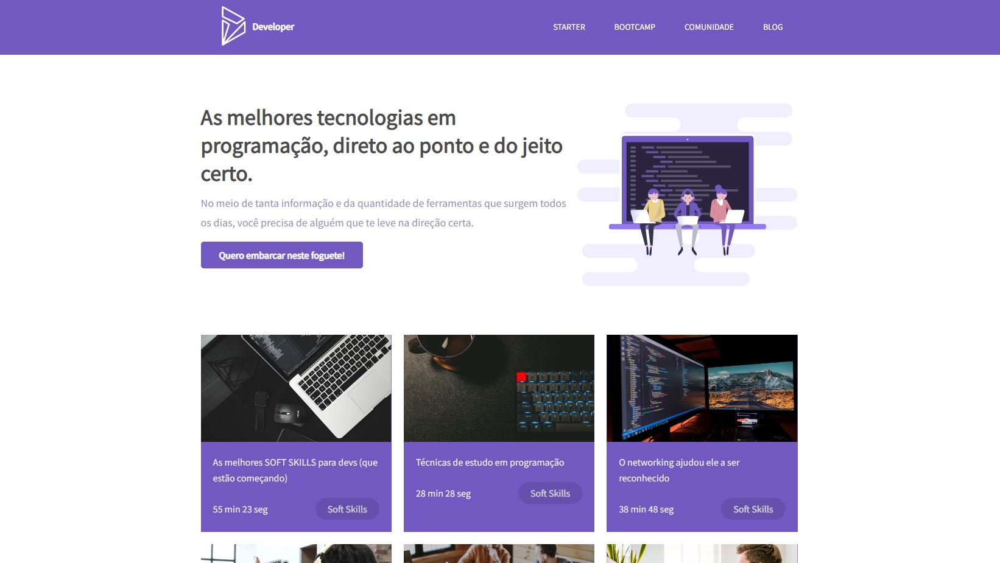
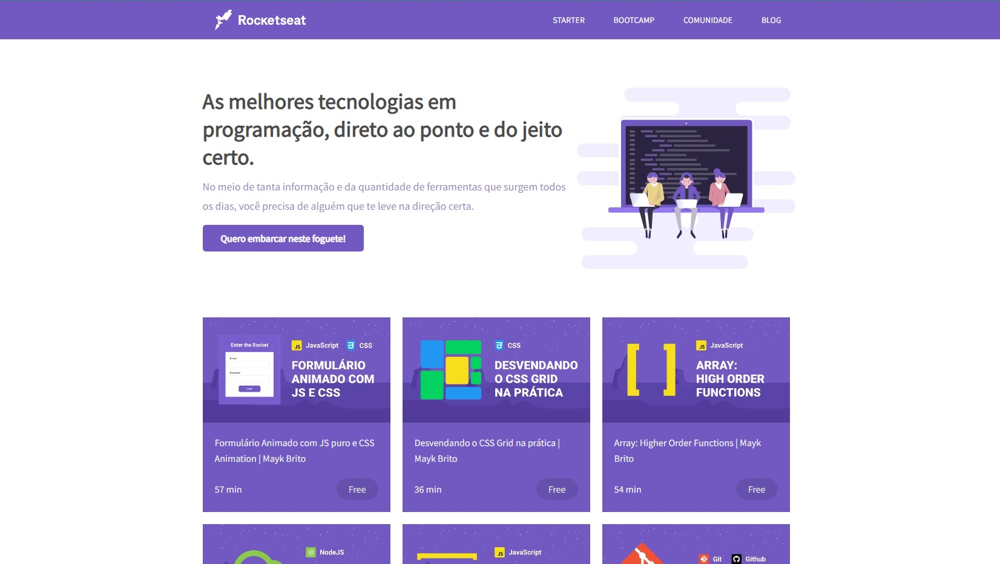
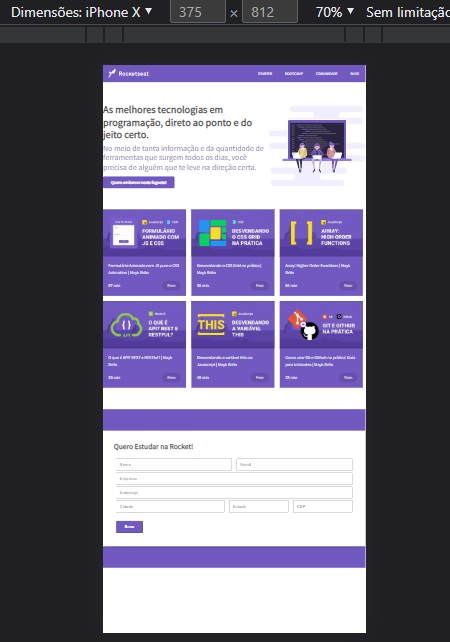
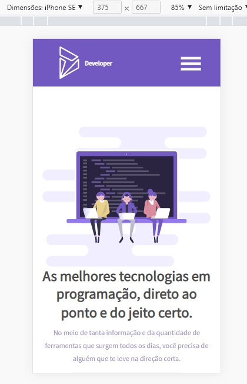
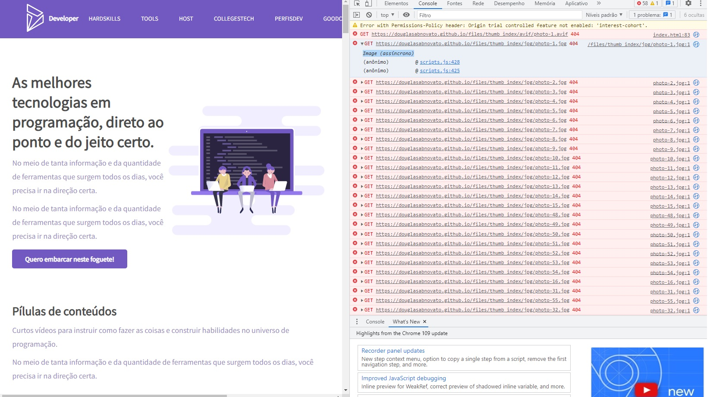
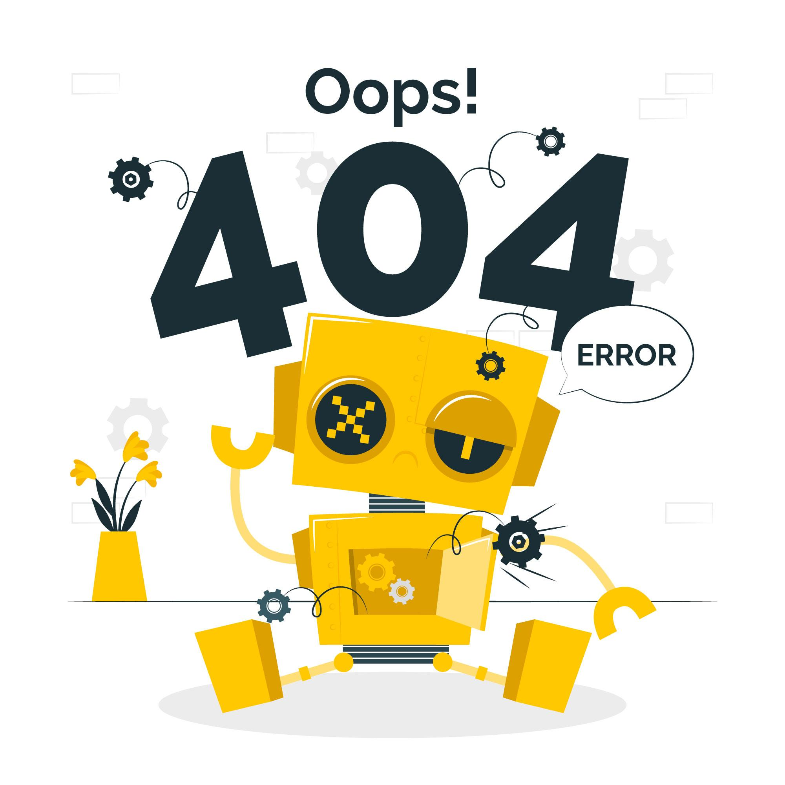

<h4 align="center"> 
	🚧 Developer 🚀
</h4>

<p align="center">
  
</p> 

## 💻 Sobre o projeto

Hub de links de conteúdo para aprender a programar, organizados em categorias: **soft skill, frontend, backend e tools**.

## ✅ Tarefas

- [x] Links organizados em categorias
- [x] Tooltip indicando a categoria do card
- [x] Objeto próprio para cada categoria
- [x] Interpretação da URL do YouTube
- [x] Logo personalizada
- [x] Favicon personalizado
- [x] Menu com área de estudo personalizada
- [x] Menu mobile com fluxo próprio
- [x] Estrutura de tópicos construída: index, hardskills, tools, host, collegestech, perfisdev, goodcompanies, jobs, softskills, speaker
- [x] Correção de warning de imagens na index (`try/catch`, `async/await`; troca de `.avif` para `.jpg`, caminho de URL encurtado)

## 🎯 Objetivo — visão maior do projeto

- [ ] Login, logout, registro e recuperação de senha
- [ ] Páginas on e off
- [ ] Newsletter
- [ ] Contato via e-mail
- [ ] Contato via WhatsApp
- [ ] Nova aba: redes sociais
- [ ] Nova aba: experiências
- [ ] Nova aba: eventos
- [ ] Funcionalidade personalizada no formulário
- [ ] Função para o botão principal

## 📖 Sobre a responsividade

A responsividade é essencial para que o layout se adapte a qualquer dispositivo — smartphone, tablet, desktop e até impressão.

Uma Masterclass da Rocketseat tratou desse tema com estratégias de **CSS Units** para deixar layout e texto fluidos, **Media Queries** para customizar o CSS por breakpoint, e atributos/tags HTML especiais para responsividade.

### 🖥️ Versão Inicial

Design inicial, sem aplicação das técnicas de responsividade.

<p align="center">
  
  
</p> 

### 📏 CSS Units — unidades de medida

**Layout fixo:**
- `px` — pixels

**Layout fluido:**
- `%` — porcentagem
- `auto` — automática
- `vh` — Viewport Height
- `vw` — Viewport Width

**Textos fixos:**
- `1px` = 0.75pt · `16px` = 12pt

**Textos fluidos:**
- `em` — multiplicado pelo elemento pai
- `rem` — multiplicado pelo root (raiz do documento)

### 📐 CSS Media Queries

```html
<meta name="viewport" content="width=device-width, initial-scale=1.0">
```

```css
@media (max-width: 320px) {
  #form h3 {
    font-size: 2rem;
  }
}
```

### 🔗 Atributo `media` no HTML

O atributo `media` pode ser usado direto no `<link>` do CSS, com a mesma sintaxe da regra `@media`:

```html
<link rel="stylesheet" href="responsive.css" media="screen and (max-width: 768px)" />
<link rel="stylesheet" href="print.css" media="print" />
```

### 🖼️ Imagens responsivas

A tag `<picture>` permite que a imagem carregada varie conforme o tamanho da tela:

```html
<picture class="image" alt="Imagem">
    <source media="(min-width: 768px)" srcset="[imagem grande]">
    <source media="(min-width: 320px)" srcset="[imagem média]">
    <source media="(min-width: 10px)" srcset="[imagem pequena]">
    
</picture>
```

> 💡 Sempre que possível, prefira SVG a JPG/PNG.

### 🖥️ Versão Final

Design com as técnicas de responsividade aplicadas.

<p align="center">
  
  
</p> 

## 🐛 Warning corrigido — GET 404

<p align="center">
   
   
</p> 

## 📚 Fonte

[Responsividade na Prática | Masterclass #08 — Rocketseat](https://www.youtube.com/watch?v=H91DhKPjhPk) · [Repositório de referência no GitHub](https://github.com/rocketseat-content/youtube-masterclass-responsividade)

---

Feito com ❤️ por