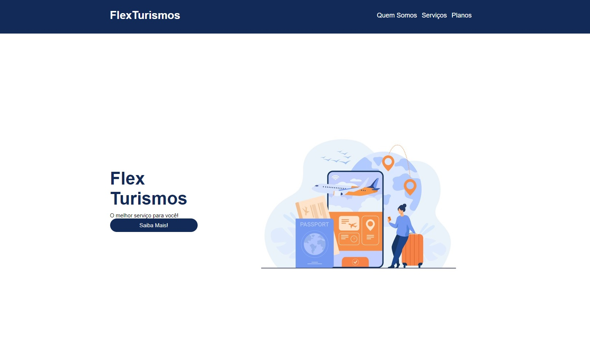
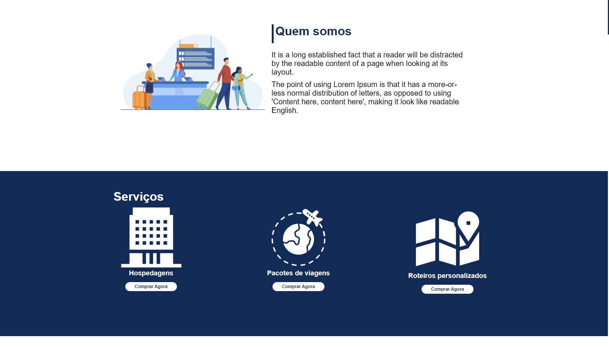
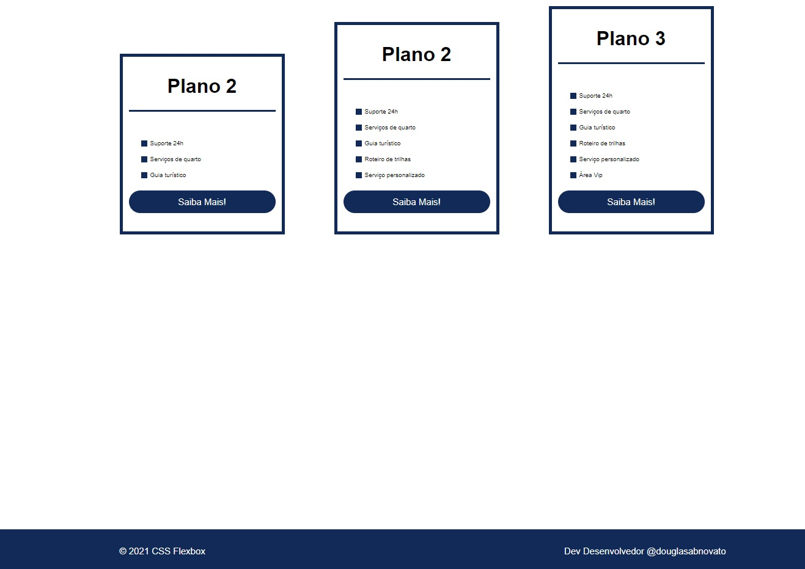
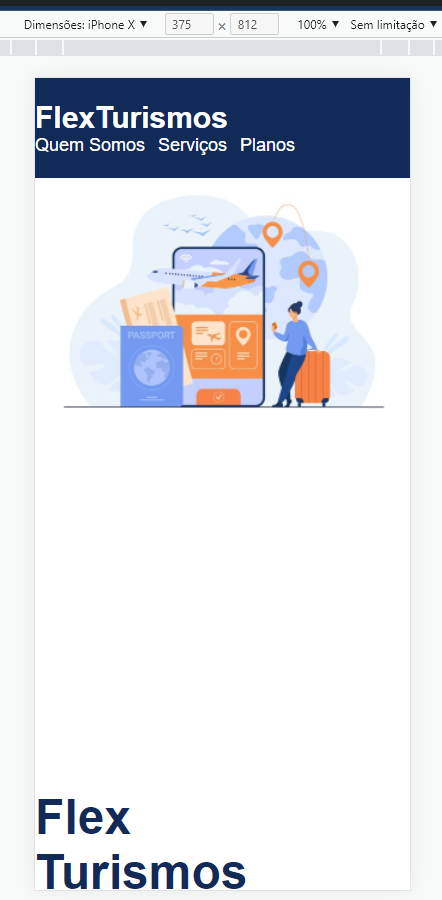
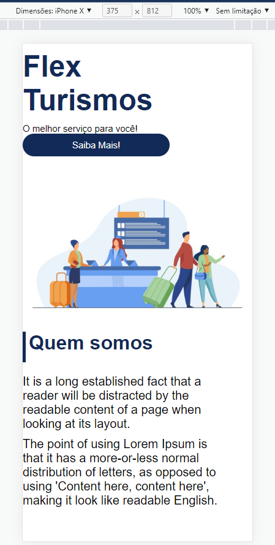
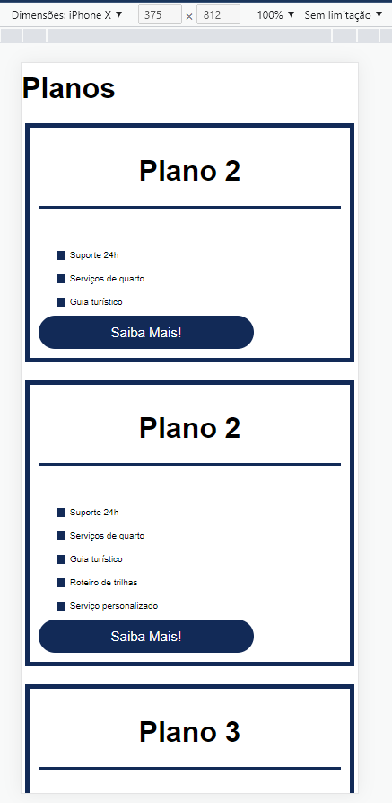
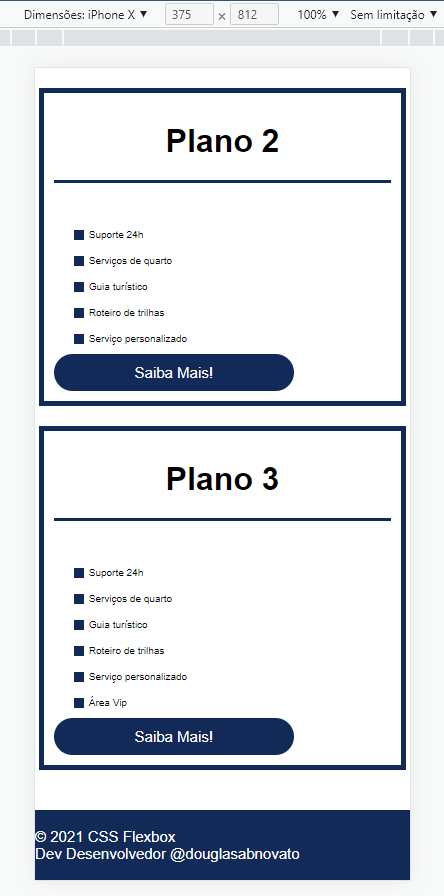
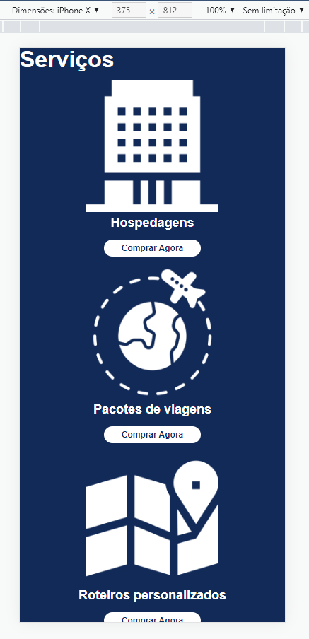

<h3 align="center"> 
	🚧 Flex Turismos 🚀
</h3> 

<h1 align="center">
    
</h1>

## 💻 Sobre o projeto

Site para divulgação de uma agência de turismo, desenvolvido com HTML, CSS e JavaScript, seguindo o paradigma **mobile first**.

## 🚀 Techs

- HTML
- CSS
- JavaScript

## 📖 Histórico de versões

### Versão 1 — Flex Turismos

Foco em Flexbox e unidades de medida flexíveis, com uma estratégia específica para facilitar os cálculos de `rem`:

```css
html { font-size: 62.5%; }
h1 { font-size: 1.2rem; }
```

Com a base em 62.5%, cada `1rem` equivale a 10px — o que simplifica a conversão de valores em pixel para `rem`:

| px | rem |
|---|---|
| 10px | 0.625rem |
| 12px | 0.75rem |
| 14px | 0.875rem |
| 16px | 1rem |
| 18px | 1.125rem |

- `em` — leva em consideração o tamanho de fonte do elemento pai
- `rem` — sempre relativo ao font-size base do documento (`html`)

<p align="center">  
   
   
  
</p>

### Versão 2 — Flex Turismos Mobile

Ajustes na media query na dimensão 992px, refinando o comportamento mobile.

<p align="center">  
   
   
  
  
  
</p>

## 🧭 Hospedagem

Hospedado no GitHub Pages, com as versões documentadas ao longo do desenvolvimento.

## 📋 Próximo passo

- [x] Favicon
- [ ] Novas seções, como depoimentos
- [ ] Adaptar lógica para a fluidez das funcionalidades
- [ ] Responsividade completa
- [ ] Acessibilidade
- [ ] Modo dark / light
- [ ] Interatividade, CRUD, JSON

---

Feito com ❤️ por Douglas A. B. Novato 👋🏽 [Entre em contato!](https://www.linkedin.com/in/douglasabnovato/)