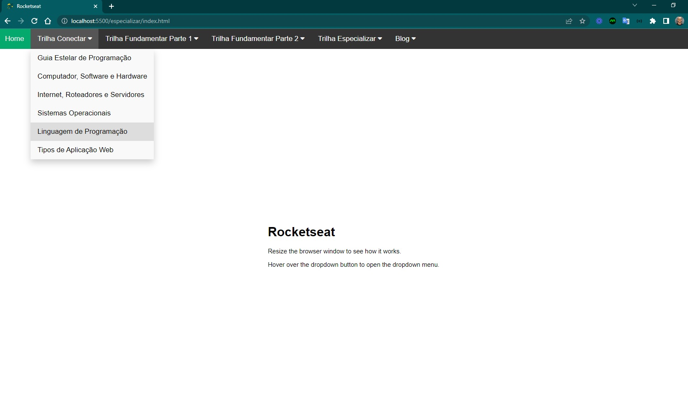

<h4 align="center"> 
	🚧 Fundamentos 🚀
</h4>

  

 

## Projeto Fundamentos

Projeto para registrar os projetos da formação Rocketseat Discover

## Sobre o projeto

Criado um layout para expor o conteúdo teórico dos treinamentos da Rocketseat.

- [x] Trilha Conectar
- [x] Trilha Fundamentar
- [x] Trilha Especializar 
- [x] Blog

Feito com ❤️ por Douglas A B Novato 👋🏽 [Entre em contato!](https://www.linkedin.com/in/douglasabnovato/)
 
Fonte do projeto na [Rocketseat](https://www.rocketseat.com.br/).