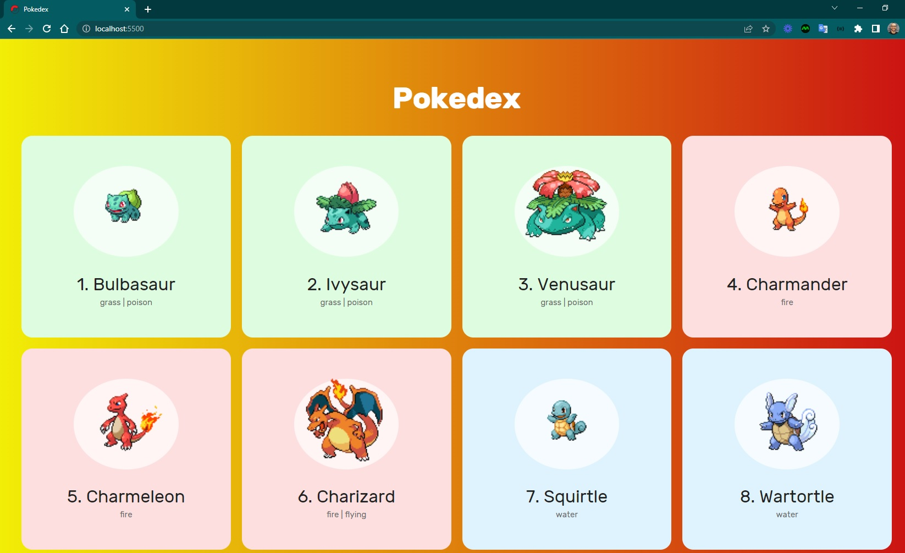
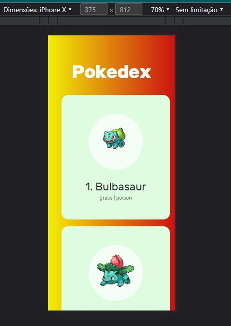

<h4 align="center"> 
	🚧 Pokedex 🚀
</h4>

  

 

## 💻 Sobre o projeto

Pokedex construída consumindo a [PokeAPI](https://pokeapi.co/docs/v2), exibindo cards estilizados e responsivos para cada Pokémon.

> 🎯 **Origem:** desafio técnico aplicado em processo seletivo para vaga de desenvolvedor.

## ✅ Requisitos

- [x] Favicon
- [x] Responsividade
- [x] Consumo da API com `fetch`
- [x] Cards estilizados para exibir cada Pokémon
- [x] Correção e registro de warnings
- [x] Documentação do projeto e telas no README
- [x] Código modularizado e refatorado

## 📚 Referências

- [Documentação PokeAPI](https://pokeapi.co/docs/v2)
- [Exemplo — busca por nome (ditto)](https://pokeapi.co/api/v2/pokemon/ditto)
- [Exemplo — busca por ID (Pikachu)](https://pokeapi.co/api/v2/pokemon/25)
- [Fonte das imagens dos Pokémon](https://raw.githubusercontent.com/PokeAPI/sprites/master/sprites/pokemon/)

## 💡 Inspiração

- [Guia de API Pokémon](https://github.com/tbone849/pokemon-guide)
- [Pokedex em JavaScript puro](https://www.youtube.com/watch?v=Uptu3NrBFBM&list=PLs_UfelOxGL25jmkIJ4pU16Ku-jfdFGC4&index=6)
- [Busca de Pokémon — HTML/CSS/JS](https://www.youtube.com/watch?v=vdytGGKyJKE&list=PLs_UfelOxGL25jmkIJ4pU16Ku-jfdFGC4&index=7)
- [Pokedex em React](https://www.youtube.com/watch?v=YIzwXNLB53Q&list=PLs_UfelOxGL25jmkIJ4pU16Ku-jfdFGC4&index=7&t=412s)
- [Pokemon Game Info](https://pokemon.gameinfo.io/)

## 🖥️ Telas

  
  

 

## 📋 Próximo passo

- [ ] Modal com mais informações do Pokémon ao clicar no card
- [ ] Funcionalidade de pesquisa por nome ou número
- [ ] Personalização visual

---

Feito com ❤️ por Douglas A. B. Novato 👋🏽 [Entre em contato!](https://www.linkedin.com/in/douglasabnovato/)