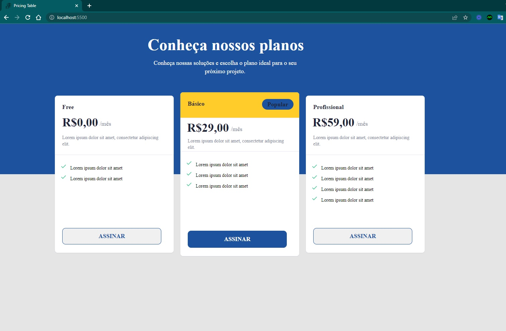
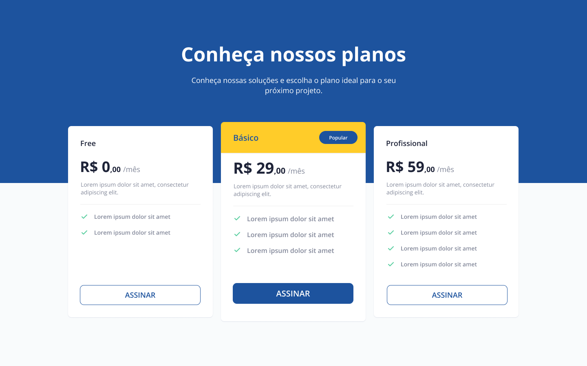
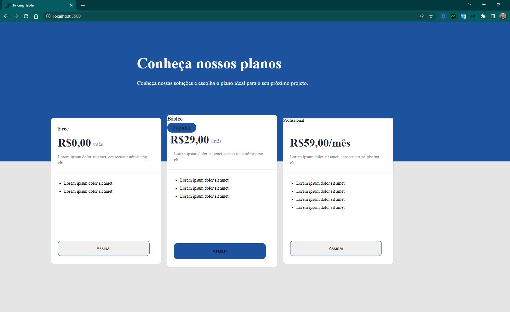

<h4 align="center"> 
	🚧 Pricing Table 🚀
</h4>

<p align="center">
  
</p>  

## 💻 Sobre o desafio

Página com uma tabela de preços/planos para apresentação de produto ou serviço, seguindo layout de referência do Figma.

**Nível:** Iniciante
**Tecnologias:** HTML e CSS
**Layout base:** [Figma oficial do desafio](https://www.figma.com/file/2EiRU7P9HpD0S1Rkd6x9Vd/DD-%2F-Pricing-Table-(Copy)?node-id=3%3A2)

## 💡 Conteúdos aplicados

- [Guia Estelar de HTML](https://app.rocketseat.com.br/discover/course/o-guia-estelar-de-html) — semântica, tags, tabelas, meta SEO e social
- [Guia Estelar de CSS](https://app.rocketseat.com.br/discover/course/o-guia-estelar-de-css) — box model, cascata, especificidade, shorthand
- [Posicionando foguetes](https://app.rocketseat.com.br/discover/course/posicionando-foguetes) — layout e posicionamento de elementos
- [Formulários de outro planeta](https://app.rocketseat.com.br/discover/course/formularios-de-outro-planeta) — a tag `form` e interação com o usuário
- [Alinhando os planetas](https://app.rocketseat.com.br/node/flexbox) — Flexbox
- [App bonito, até nos textos](https://app.rocketseat.com.br/node/flexbox) — tipografia na web com CSS

## 🎨 Style Guide

**Cores:**
```css
:root {
  --yellow: #ffcc29;
  --blue: #1d539e;
  --gray: #828799;
  --page-background: #f9fbfc;
}
```

**Tipografia:** Open Sans (weights 400, 600 e 700) — disponível no [Google Fonts](https://fonts.google.com/)

**Referência visual:**
<p align="center">
  
</p>

## ✅ Requisitos do desafio

- [x] Desenvolver seguindo o layout do Figma

**Bônus:**
- [ ] Layout responsivo
- [ ] Uso de variáveis CSS

## 📋 Status do projeto

- [x] Organização do README
- [x] Branches `main` e `developer`
- [x] Favicon
- [ ] Aplicação da fonte Open Sans
- [ ] [Learn Responsive Design](https://web.dev/learn/design/)
- [ ] [Learn CSS](https://web.dev/learn/css/)

## 🖥️ Telas

<p align="center">
  
  
</p>  

## 📚 Fonte

Desafio da [Rocketseat](https://www.rocketseat.com.br/) — [requisitos completos](https://efficient-sloth-d85.notion.site/Desafio-Pricing-Table-e0b6f59253e54d229fdde09228226b32)

---

Feito com ❤️ por Douglas A. B. Novato 👋🏽 [Entre em contato!](https://www.linkedin.com/in/douglasabnovato/)

Participe da [comunidade aberta da Rocketseat](https://discord.gg/bacwY2gDCF)!