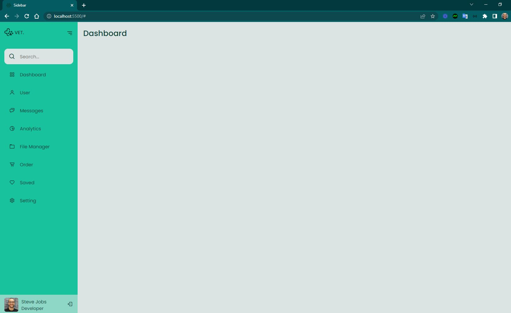
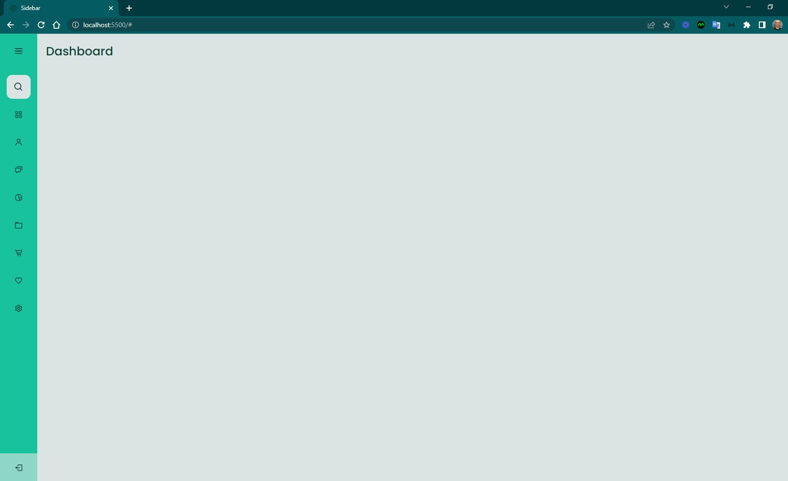
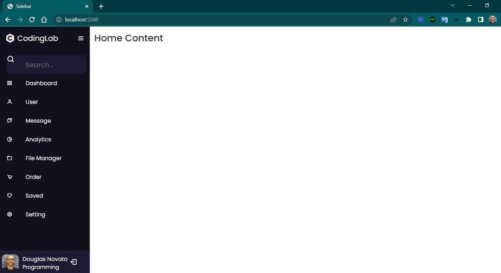
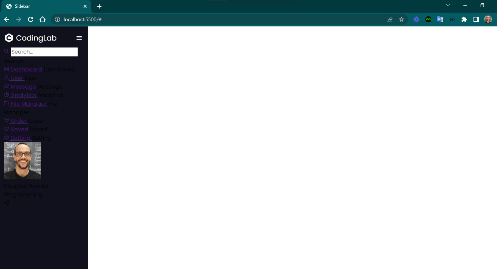
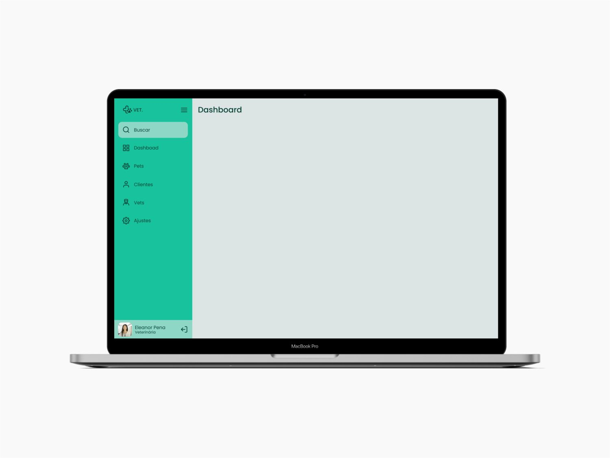
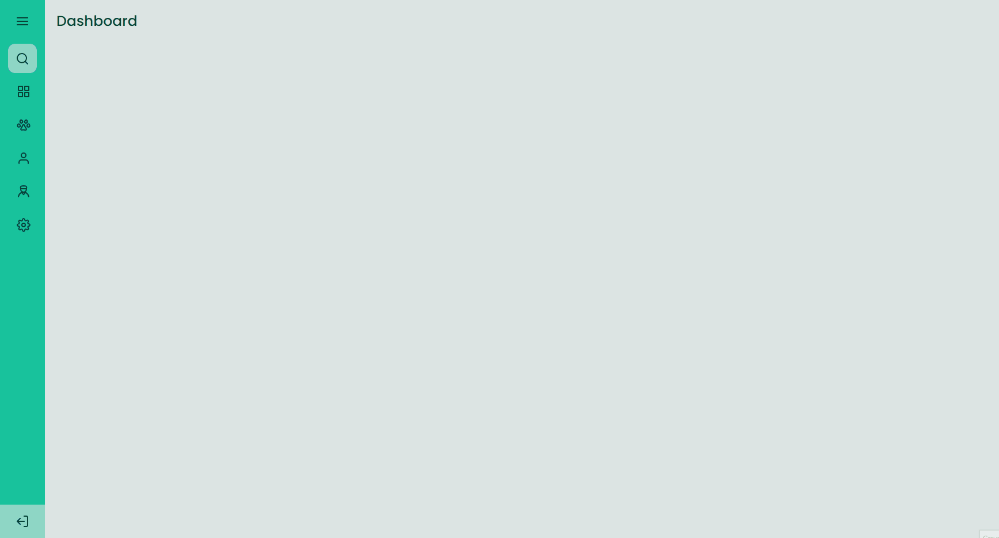

<h4 align="center"> 
	🚧 Sidebar Green 🚀
</h4>

<p align="center">
  
</p>  

## 💻 Sobre o desafio

Sidebar responsiva que alterna entre dois estados ao clique do usuário: **aberta** (exibindo ícones e texto) e **fechada** (exibindo apenas ícones). Estrutura com perfil, itens de menu e card de avatar, seguindo layout do [Figma oficial do desafio](https://www.figma.com/file/qOlC6p8VYPoU25CDIaKI25/DD-Sidebar-Responsiva-Copy?fuid=850142401757702475).

**Nível:** Intermediário
**Tecnologias:** HTML, CSS e JavaScript

## 💡 Conteúdos aplicados

- [Guia Estelar de JavaScript](https://app.rocketseat.com.br/node/o-guia-estelar-de-java-script) — tipos de dados, variáveis, funções, manipulação de dados
- [Pilotando com a DOM](https://app.rocketseat.com.br/node/pilotando-com-a-dom) — seletores (`getElementById`, `querySelector`, `querySelectorAll`), manipulação de conteúdo e estilo, `classList`, eventos via JS
- [Alinhando os planetas](https://app.rocketseat.com.br/node/flexbox) — Flexbox

## 🎨 Style Guide

**Cores:**
```css
:root {
  --body-bg-color: #dce4e3;
  --green: #18c29c;
  --light-green: #8ed7c6;
  --light-grey: #dce4e3;
  --text-color: #084236;
}
```

**Tipografia:** [Poppins](https://fonts.google.com/) (weights 400 e 500)

**Ícones:** [boxicons](https://boxicons.com/)

## 🖥️ Telas — evolução do layout (Desktop)

<p align="center">
  
  
  
  
</p>

<p align="center">
  
  
</p>

## ✅ Tarefas concluídas

- [x] Organização do README
- [x] Branches `main` e `developer`
- [x] Favicon
- [x] Integração com boxicons
- [x] Estrutura HTML com sidebar, perfil, itens de menu e card de avatar
- [ ] [Learn Responsive Design](https://web.dev/learn/design/)
- [ ] [Learn CSS](https://web.dev/learn/css/)

## 📚 Fonte e referências

Desafio da [Rocketseat](https://www.rocketseat.com.br/) — [requisitos completos](https://efficient-sloth-d85.notion.site/Desafio-Sidebar-f2251eb4976941eb958326ea327ffeb9) · [referência técnica adicional](https://www.codinglabweb.com/2021/04/responsive-side-navigation-bar-in-html.html)

---

Feito com ❤️ por Douglas A. B. Novato 👋🏽 [Entre em contato!](https://www.linkedin.com/in/douglasabnovato/)

Participe da [comunidade aberta da Rocketseat](https://discord.gg/bacwY2gDCF)!