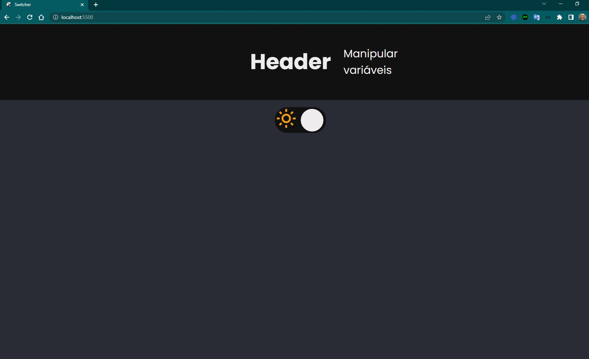
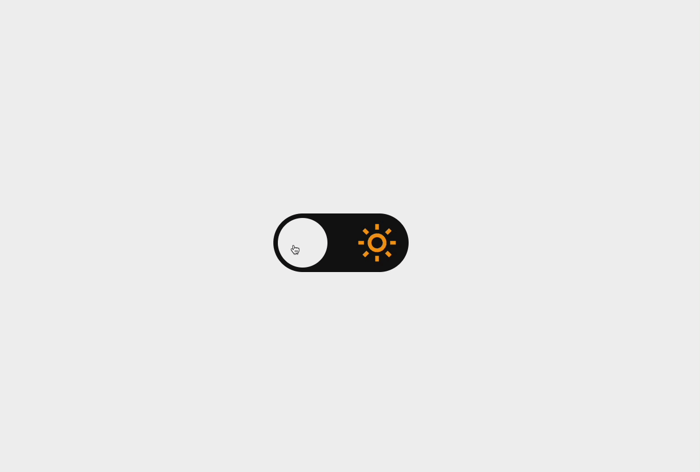
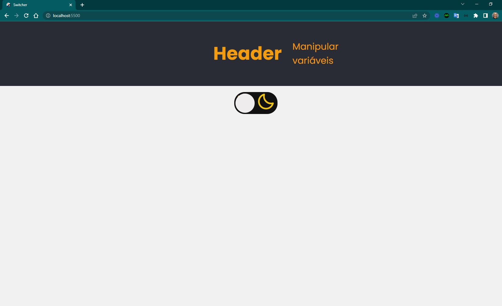

<h4 align="center"> 
	🚧 Switcher 🚀
</h4>

<p align="center">
  
</p>  

## 💻 Sobre o desafio

Página com um **theme switcher**: toggle que alterna entre tema dark e light, com transição suave entre os ícones e a preferência do usuário salva no navegador.

**Nível:** Intermediário
**Tecnologias:** HTML, CSS e JavaScript
**Layout base:** [Figma oficial do desafio](https://www.figma.com/file/CtyAtRf9aMCY3Ekg8KVHyq/DD-%2F-Theme-Switcher-(Copy))

## 💡 Conteúdos aplicados

- [Guia Estelar de HTML](https://app.rocketseat.com.br/discover/course/o-guia-estelar-de-html) — semântica, tags, meta SEO e meta social
- [Guia Estelar de CSS](https://app.rocketseat.com.br/discover/course/o-guia-estelar-de-css) — box model, cascata, especificidade, shorthand
- [Pilotando com a DOM](https://app.rocketseat.com.br/discover/course/pilotando-com-a-dom) — seletores, manipulação de estilo e classe, eventos via JS

## ✅ Requisitos do desafio

**Principais:**
- [x] Alterar o tema da página ao clicar no toggle
- [x] Transição entre um ícone e outro

**Extras:**
- [x] Tema salvo no Local Storage
- [x] Textos e cores mudam conforme o tema (light/dark)

## 🎨 Style Guide

**Cores:**
```css
:root {
	--dark: #292C35;
	--light: #F1F1F1;
	--label: #111;
}
```

**Tipografia:** [Poppins](https://fonts.google.com/) (weights 300, 400 e 500)

## 🖥️ Preview

<p align="center">
  
</p>

## 📋 Status do projeto

- [x] Toggle posicionado no centro
- [ ] **Responsividade** — ainda pendente, próximo passo do projeto

## 🖥️ Telas — evolução do layout

<p align="center">
  
  
</p>

## 📚 Fonte

Desafio da [Rocketseat](https://www.rocketseat.com.br/) — [requisitos completos](https://efficient-sloth-d85.notion.site/Desafio-Theme-Switcher-dbabdf77f70d43298df382c8e805fc13)

---

Feito com ❤️ por Douglas A. B. Novato 👋🏽 [Entre em contato!](https://www.linkedin.com/in/douglasabnovato/)

Participe da [comunidade aberta da Rocketseat](https://discord.gg/bacwY2gDCF)!