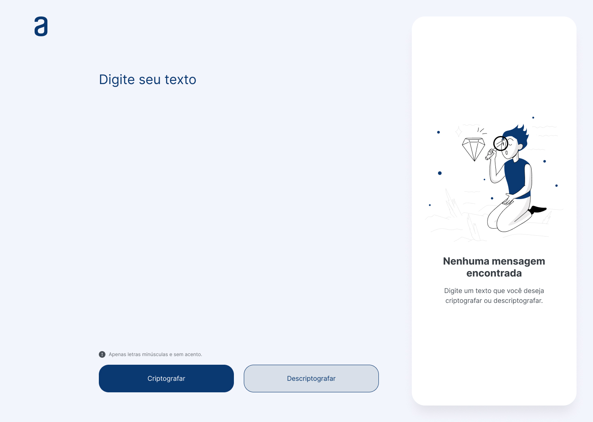
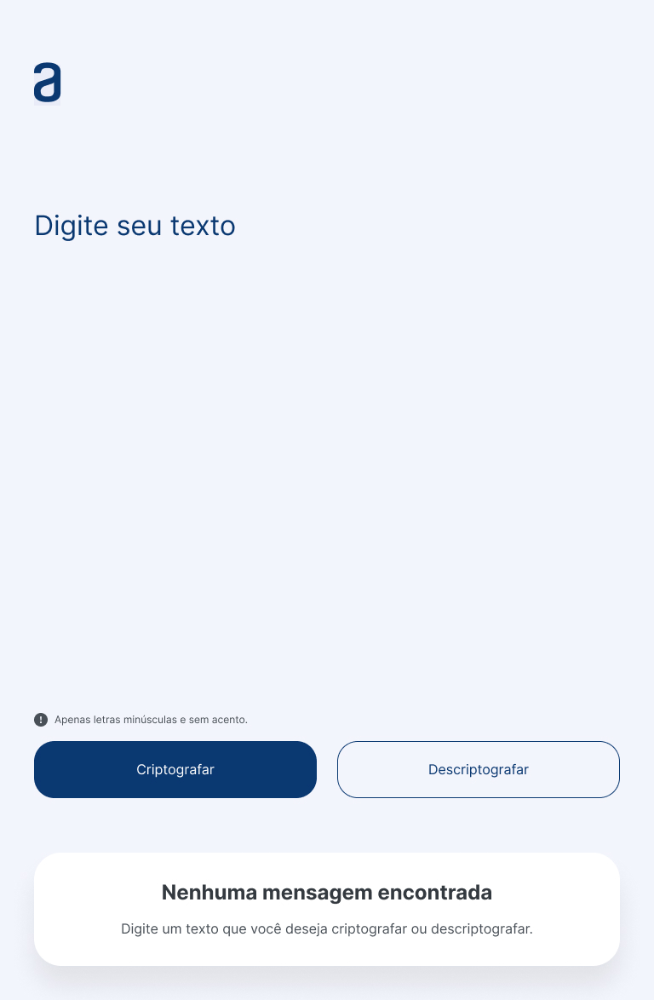
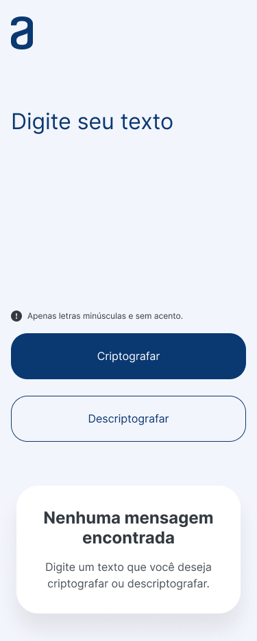
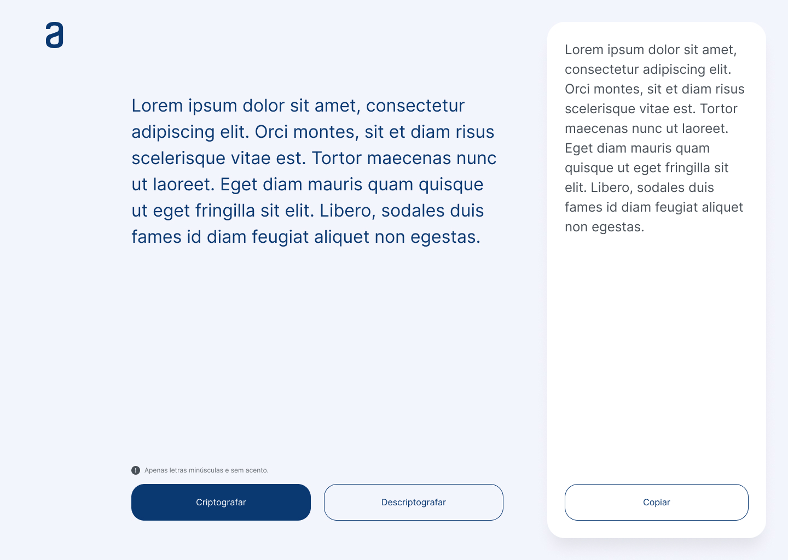
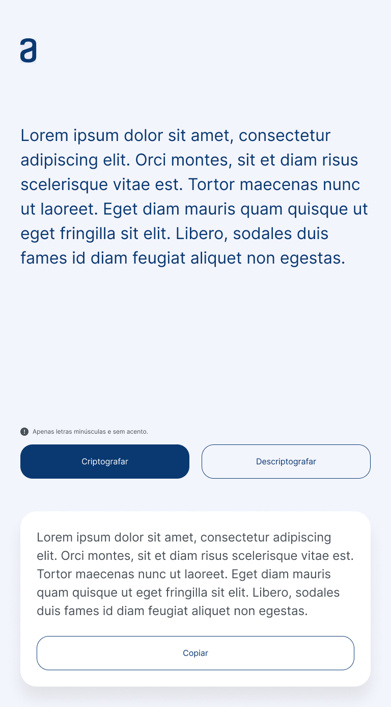
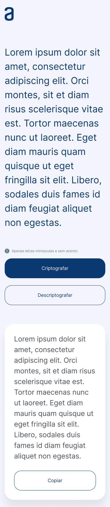

<h4 align="center"> 
	🚧 Text Decoder 🚀
</h4>

   

 

## 💻 Sobre o projeto

Desenvolvimento de habilidades em **lógica de programação com JavaScript** e **estilização com HTML/CSS**, através da criação de um **Decodificador de Texto** — desafio do [Challenge ONE (Alura Latam + Oracle)](https://www.alura.com.br/challenges/challenge-one-logica).

Layout seguindo o [design oficial no Figma](https://www.figma.com/file/oyLhf95YznIWjFKmN7Awcx/Alura-Challenge---Desafio-1---Decodificador-de-Texto?node-id=49%3A477&mode=dev).

## 🔐 Como funciona a codificação

Cada vogal é substituída por uma "chave" específica:

| Vogal | Chave |
|---|---|
| `e` | `enter` |
| `i` | `imes` |
| `a` | `ai` |
| `o` | `ober` |
| `u` | `ufat` |

## 🖥️ Telas

**Tela 1 — Desktop:**

   

 

**Tela 1 — Tablet e Mobile:**

  
   
   

 

**Tela 2 — Desktop:**

    

 

**Tela 2 — Tablet e Mobile:**

  
   
   

 

## 🌳 Gestão do projeto

- `main` — projeto em produção
- `challenge-1` — versão do desafio
- Uma branch por grupo de tarefas que gera valor (ex: `feature/html-css`, `feature/js-logica`)

## ✅ Desenvolvimento

- [x] Branch `challenge-1` criada
- [x] Branch `feature/html-css` criada
- [x] VS Code configurado com Live Server
- [x] Estrutura HTML
- [x] Favicon
- [x] Google Fonts: [Inter](https://fonts.google.com/specimen/Inter?query=inter)
- [x] Ícone e imagem
- [x] Branch `feature/js-logica` criada

**Fluxo de merge:** cada tarefa é desenvolvida em sua branch de feature, mesclada em `challenge-1` para validação, testes e aprovação, e só então mesclada na branch de produção `main`.

## 🔧 Aperfeiçoamentos

**CSS:**
- [ ] Uso de variáveis para melhorar o código
- [ ] Responsividade

**HTML:**
- [ ] Revisão das tags semânticas
- [ ] Nomes em inglês

**JavaScript:**
- [ ] Função para o botão de copiar
- [ ] Adicionar 1 funcionalidade extra
- [ ] Criptografar o alfabeto inteiro
- [ ] Criptografar os números

## 📚 Referências

- [Parte I — HTML e CSS (vídeo)](https://www.youtube.com/watch?v=04QvWw4aHlk)
- [Parte II — Lógica com JavaScript (vídeo)](https://www.youtube.com/watch?v=e3PasHJMIF8)
- [Challenge Decodificador — repositório de referência](https://github.com/logica-programacion/Solucao-Challenge-Decodificador)
- [Challenge One Decodificador BR](https://github.com/alura-challenges/challenge-one-decodificador-br)

## 🎓 Challenge ONE

- [Instruções do Challenge ONE](https://www.alura.com.br/challenges/challenge-one-logica)
- [Detalhes da Sprint 1 — Decodificador](https://www.alura.com.br/challenges/challenge-one-logica/sprint01-construa-decodificador-texto-com-javascript)
- [Explicação em vídeo](https://www.youtube.com/watch?v=VwVC_bLcOGE)
- [Trello do projeto](https://trello.com/b/EmUFmjCv/decodificador-de-texto-alura-challenges-oracle-one)
- [Figma do projeto](https://www.figma.com/file/tvFEYhVfZTjdJ5P24RGV21/Alura-Challenge---Desafio-1---L%C3%B3gica?node-id=16%3A802&mode=dev)
- [Entrega do Challenge](https://lp.alura.com.br/alura-latam-entrega-challenge-one-portugues)

## 🚀 Resultado

Projeto publicado e funcionando: **[douglasabnovato.github.io/text-decoder](https://douglasabnovato.github.io/text-decoder/)**

---

Feito com ❤️ por Douglas A. B. Novato 👋🏽 [Entre em contato!](https://www.linkedin.com/in/douglasabnovato/)