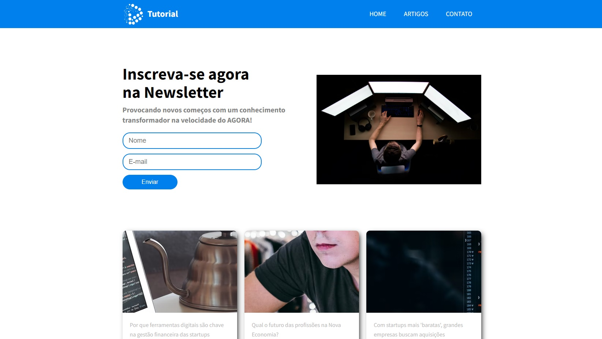
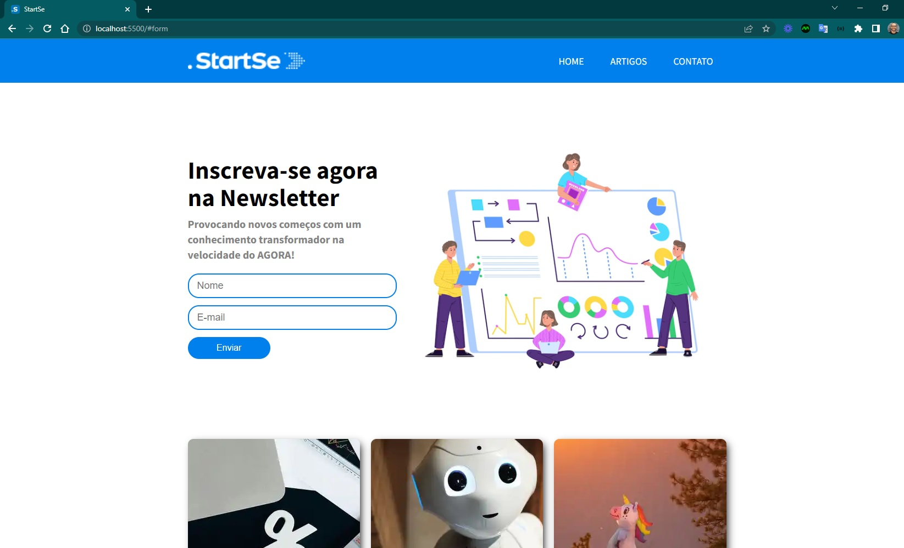
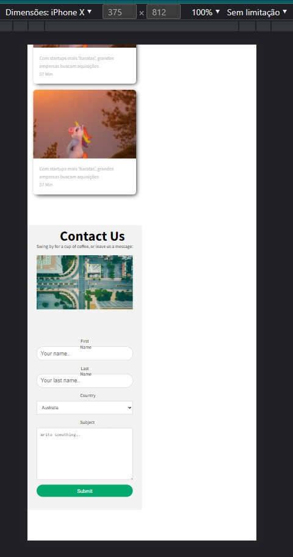

<h4 align="center"> 
	🚧 Tutorial 🚀
</h4>

<h1 align="center">
    
</h1>

## 💻 Sobre o projeto

Site institucional para reunir conteúdos próprios — projeto em construção, ainda em estágio inicial.

## 📋 Requisitos

- [x] Favicon
- [x] Logo e nome
- [ ] Design personalizado
- [ ] Responsividade
- [ ] Estilização da página de item
- [ ] Personalização dinâmica da página
- [ ] Conteúdo dos cards estruturado em objeto

## 🖥️ Telas

**Desktop:**

    
    

**Mobile:**

    

## 💡 Inspirações para aperfeiçoamento

- Levantar funcionalidades presentes em blogs/sites institucionais de referência

---

Feito com ❤️ por Douglas A. B. Novato 👋🏽 [Entre em contato!](https://www.linkedin.com/in/douglasabnovato/)